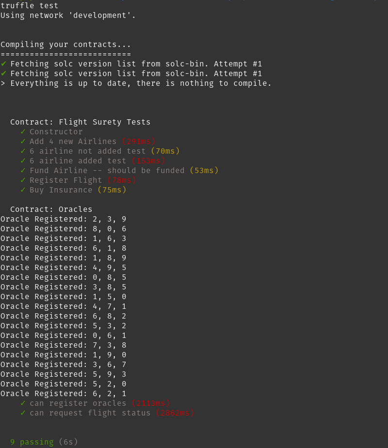

# Fight Insurance Dapp

In this repository there's an Ethereum DApp Project that simulates a flight insurance application. 

It contaoins a server that simulates external oracles providing information about the flight status an a DApp application that can interact with the main functions of the SmartContract. 

Default Provider configuration of the DApp is HTTPProvider so use it with a local network and manage interactions through ganache console as recommendation.

The project uses the next libraries and versions. A brief description of its use is provided:

| Library/Module/Tool | Version | Description
|---|---|---|
| *Truffle* | 5.4.5 (core: 5.4.5) | Smart contract development environment
| *Solidity* | 0.4.24 (solc-js) | Object-oriented, high-level language for implementing smart contracts
| *Node* | 14.16.0 | JavaScript runtime that allow to develop different type de applications
| *Web3.js* | 1.2.0 | Collection of libraries that allow you to interact with a local or remote ethereum node using HTTP, IPC or WebSocket.
| *webpack* | 4.6.0 | Allow to create the Dapp UI and simulate Oracles server.
| *ganache-cli* | 6.12.2 | Local ethereum blockchain emulator.

# Installation
Run the next steps to run the application:

Run this command inside the root FlightSurety folder project:
```bash
npm install
```

Compile the smart contracts
```bash
truffle compile
```

Execute ganache-cli with next parameters (This command is required to be executed before run tests or deploy the smart contracts):
```bash
ganache-cli -a 20 -l 9999999 -m "candy maple cake sugar pudding cream honey rich smooth crumble sweet treat"
```

Terminal will show these address:
```text
Available Accounts
==================
(0) 0x627306090abaB3A6e1400e9345bC60c78a8BEf57 (100 ETH)
(1) 0xf17f52151EbEF6C7334FAD080c5704D77216b732 (100 ETH)
(2) 0xC5fdf4076b8F3A5357c5E395ab970B5B54098Fef (100 ETH)
(3) 0x821aEa9a577a9b44299B9c15c88cf3087F3b5544 (100 ETH)
(4) 0x0d1d4e623D10F9FBA5Db95830F7d3839406C6AF2 (100 ETH)
(5) 0x2932b7A2355D6fecc4b5c0B6BD44cC31df247a2e (100 ETH)
(6) 0x2191eF87E392377ec08E7c08Eb105Ef5448eCED5 (100 ETH)
(7) 0x0F4F2Ac550A1b4e2280d04c21cEa7EBD822934b5 (100 ETH)
(8) 0x6330A553Fc93768F612722BB8c2eC78aC90B3bbc (100 ETH)
(9) 0x5AEDA56215b167893e80B4fE645BA6d5Bab767DE (100 ETH)
(10) 0xE44c4cf797505AF1527B11e4F4c6f95531b4Be24 (100 ETH)
(11) 0x69e1CB5cFcA8A311586e3406ed0301C06fb839a2 (100 ETH)
(12) 0xF014343BDFFbED8660A9d8721deC985126f189F3 (100 ETH)
(13) 0x0E79EDbD6A727CfeE09A2b1d0A59F7752d5bf7C9 (100 ETH)
(14) 0x9bC1169Ca09555bf2721A5C9eC6D69c8073bfeB4 (100 ETH)
(15) 0xa23eAEf02F9E0338EEcDa8Fdd0A73aDD781b2A86 (100 ETH)
(16) 0xc449a27B106BE1120Bd1Fd62F8166A2F61588eb9 (100 ETH)
(17) 0xF24AE9CE9B62d83059BD849b9F36d3f4792F5081 (100 ETH)
(18) 0xc44B027a94913FB515B19F04CAf515e74AE24FD6 (100 ETH)
(19) 0xcb0236B37Ff19001633E38808bd124b60B1fE1ba (100 ETH)

Private Keys
==================
(0) 0xc87509a1c067bbde78beb793e6fa76530b6382a4c0241e5e4a9ec0a0f44dc0d3
(1) 0xae6ae8e5ccbfb04590405997ee2d52d2b330726137b875053c36d94e974d162f
(2) 0x0dbbe8e4ae425a6d2687f1a7e3ba17bc98c673636790f1b8ad91193c05875ef1
(3) 0xc88b703fb08cbea894b6aeff5a544fb92e78a18e19814cd85da83b71f772aa6c
(4) 0x388c684f0ba1ef5017716adb5d21a053ea8e90277d0868337519f97bede61418
(5) 0x659cbb0e2411a44db63778987b1e22153c086a95eb6b18bdf89de078917abc63
(6) 0x82d052c865f5763aad42add438569276c00d3d88a2d062d36b2bae914d58b8c8
(7) 0xaa3680d5d48a8283413f7a108367c7299ca73f553735860a87b08f39395618b7
(8) 0x0f62d96d6675f32685bbdb8ac13cda7c23436f63efbb9d07700d8669ff12b7c4
(9) 0x8d5366123cb560bb606379f90a0bfd4769eecc0557f1b362dcae9012b548b1e5
(10) 0xdbb9d19637018267268dfc2cc7aec07e7217c1a2d6733e1184a0909273bf078b
(11) 0xaa2c70c4b85a09be514292d04b27bbb0cc3f86d306d58fe87743d10a095ada07
(12) 0x3087d8decc5f951f19a442397cf1eba1e2b064e68650c346502780b56454c6e2
(13) 0x6125c8d4330941944cc6cc3e775e8620c479a5901ad627e6e734c6a6f7377428
(14) 0x1c3e5453c0f9aa74a8eb0216310b2b013f017813a648fce364bf41dbc0b37647
(15) 0xea9fe9fd2f1761fc6f1f0f23eb4d4141d7b05f2b95a1b7a9912cd97bddd9036c
(16) 0xfde045729ba416689965fc4f6d3f5c8de6f40112d2664ab2212208a17842c5c9
(17) 0xd714e4a16a539315abb2d86401e4ceae3cf901849769345e3ab64ee46d998b64
(18) 0x737f5c61de545d32059ce6d5bc72f7d34b9963310adde62ef0f26621266b65dc
(19) 0x49b2e2b48cfc25fda1d1cbdb2197b83902142c6da502dcf1871c628ea524f11b
```

If you want to run the test cases:
```bash
truffle test
```

The result should be something like this:



To deploy the smart contracts to Ganache you must run in terminal:
```bash
truffle migrate --network development
```

The smart contracts will have the following addresses:

| Contract | Address |
|---|---|
|  *FlightSuretyData* | 0x345cA3e014Aaf5dcA488057592ee47305D9B3e10
|  *FlightSuretyApp* | 0xf25186B5081Ff5cE73482AD761DB0eB0d25abfBF

Start the server that register the Oracles and simulates their responses:
```bash
npm run server
```
You should see this results in terminal:


To run the dapp frontend you should run this command:
```bash
npm run server
```
The result is:


The Dapp has 5 different sections.

1. Operational status: shows if the smart contracts are operative or locked.
2. Airline registration: allows the user to execute actions relative to the airlines

| Action | Notes |
|  *Register* | Airline Name and Airline Address are required.
|  *Action over Airline* | Fund, Vote, Is registered, Is Funded and Is Pending actions require that user inputs the Airline Address.

3. Flight registration: allows the user to register a Flight to be referenced in the insurance buying process.

| Action | Notes |
|  *Register* | Flight Name, Timestamp,  Airline Address, From (origin of the flight) and To (destination) are required.


4. Insure Flight: Allows a passenger to buy an insurance for an specific flight.

| Action | Notes |
|  *Buy* | Flight Name, Airline Address, Timestamp and amount are required.
|  *Fetch Flight Status* | Send a request for the simulated oracles that are running in the server part. Flight Name, Airline Address and Timestamp are required fields.

5. Passenger Detail: Allow a passenger verify his/her accredited amount when a flight is delayed. Also allow him to withdraw the credit.

| Action | Notes |
|  *Check Credit Pending to Withdraw* | Passenger Address is required.
|  *Withdraw* | Passenger Address is required. Allow the user to withdraw the credit obtained by his/her purchased insurance.